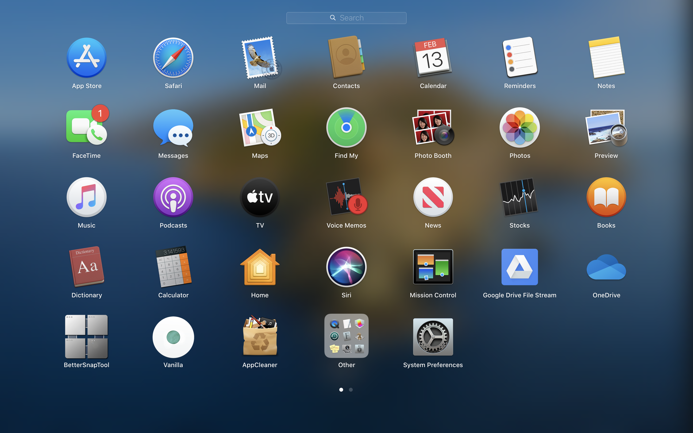
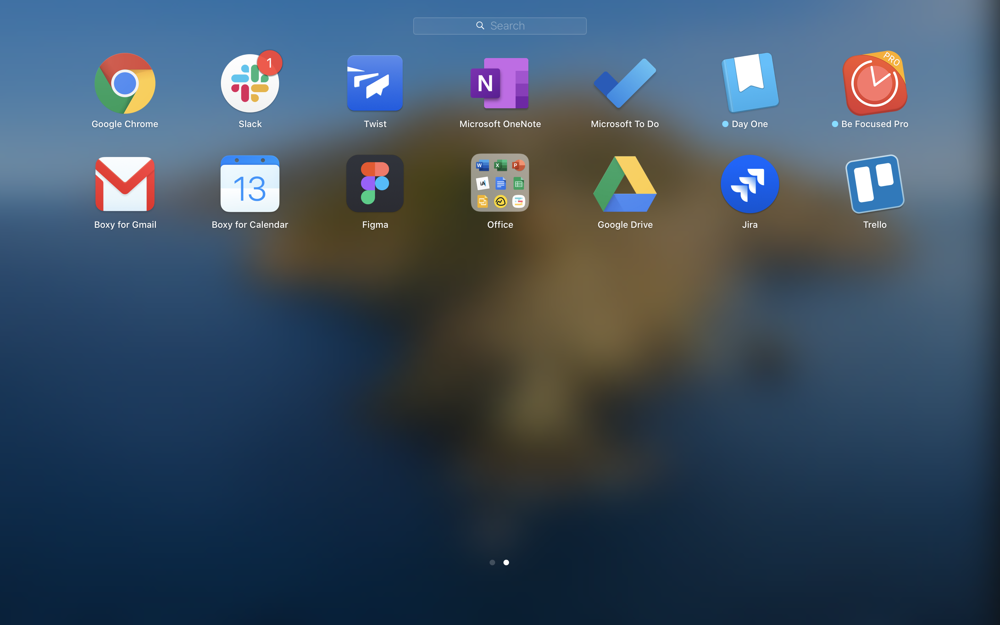

# All other apps

## Apps in my Main Launchpad Secreen

Below are the apps I currently have in my main launchpad screen

### Apps not available in the Appstore are

- [AppCleaner](https://freemacsoft.net/appcleaner/): to remove apps and all related files.
- [Vanilla](https://matthewpalmer.net/vanilla/): to hide menu bar icons on your Mac.

---

## Apps in my Secondary Launchpad Screen

Below are the apps I currently have in my secondary launchpad screen

### Apps not available in the Appstore are

- [Balsamiq](https://balsamiq.com/)
- [Boxy Suite](https://www.boxysuite.com/?referral=RZJmjQkzfZejiL9csmCQVZ)
- [Google Chrome](https://www.google.com/chrome/)
- [Figma](https://www.figma.com/)
- [Github Desktop](https://desktop.github.com/)
- [Google Play Music for Desktop](https://www.googleplaymusicdesktopplayer.com/)
- [Microsoft Office](https://account.microsoft.com/services/office/install)
