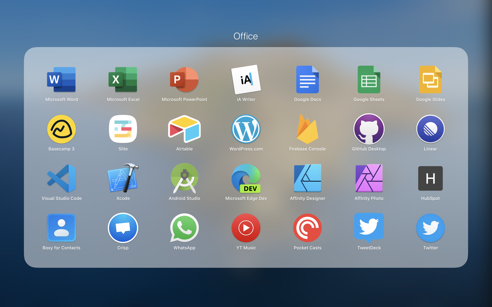

# All other apps

Below are the apps I currently have installed in my mac

### Apps in my Main Launchpad Screen

#### Apps not available from the Appstore are

- [AppCleaner](https://freemacsoft.net/appcleaner/): to remove apps and all related files.
- [Vanilla](https://matthewpalmer.net/vanilla/): to hide menu bar icons on your Mac.
- [Reverse Scroller](https://pilotmoon.com/scrollreverser/): to independently reverse mouse scrolling while keep natural scrolling on the trackpad (great for when you have non-magic mouse pointers).

---

### Apps in my Secondary Launchpad Screen

### Apps in the folder of my Secondary Launchpad Screen

### Apps not available from the Appstore are

- [Balsamiq](https://balsamiq.com/)
- [Boxy Suite](https://www.boxysuite.com/?referral=RZJmjQkzfZejiL9csmCQVZ)
- [Figma](https://www.figma.com/)
- [Google Chrome](https://www.google.com/chrome/)
- [Github Desktop](https://desktop.github.com/)
- [Youtube Music](https://ytmusic.app)
- [Google Drive File Stream](https://support.google.com/drive/answer/7329379)
- [Microsoft Edge](https://www.microsoftedgeinsider.com/en-gb/)
- [Microsoft Office](https://account.microsoft.com/services/office/install)
- [Pocket Casts](https://support.pocketcasts.com/article/desktopother-app/)
