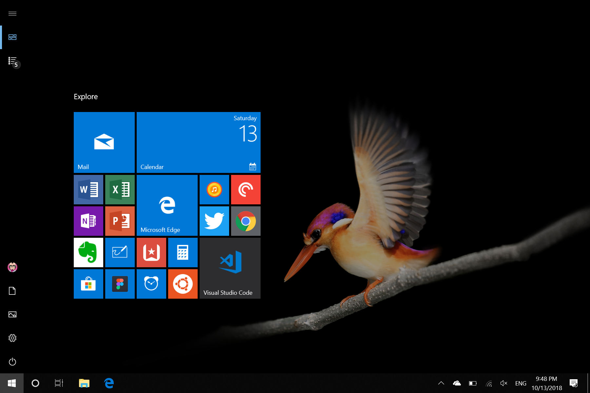

# All other apps

Below are the apps I currently have installed in my Surface

#### Apps not available from the Microsoft Store are

- [Balsamiq](https://balsamiq.com/)
- [Google Chrome](https://www.google.com/chrome/)
- [Figma](https://www.figma.com/)
- [Github Desktop](https://desktop.github.com/)
- [Google Play Music for Desktop](https://www.googleplaymusicdesktopplayer.com/)
- [Google Drive File Stream](https://support.google.com/drive/answer/7329379)
